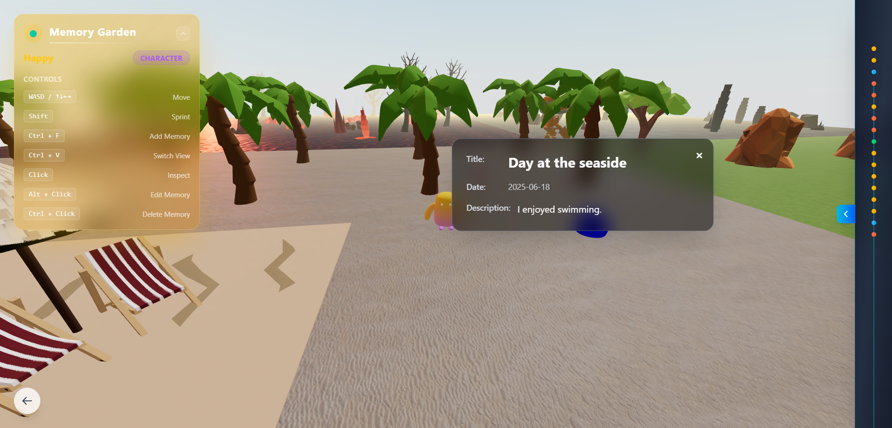
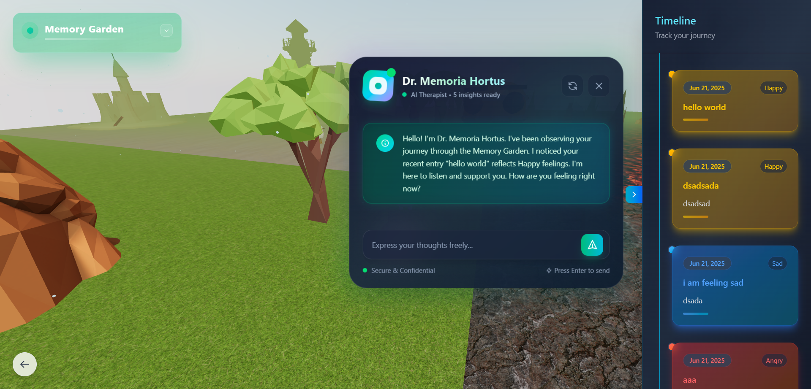
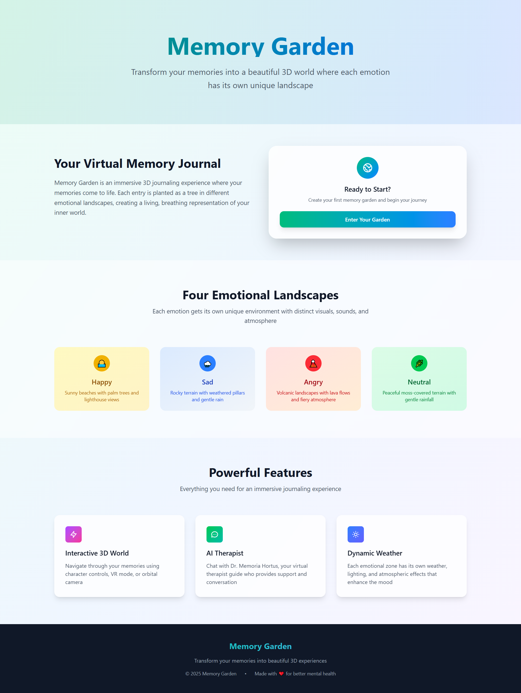
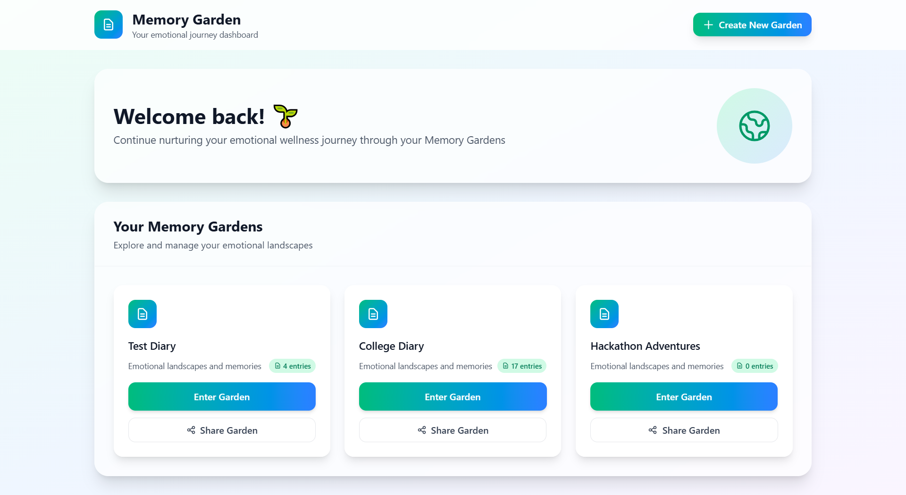

<h1 align="center">Memory Garden 🌱</h1>

Memory Garden is an immersive 3D journaling experience where your memories come to life as trees in different emotional landscapes. Each journal entry is planted in one of four distinct emotional zones, creating a living, breathing representation of your inner world.

[🚀 Launch the Experience](https://creme332.github.io/memory-garden)

## Screenshots






## Features

- **Privacy-First Architecture** – No traditional backend; all data stored locally with IndexedDB via Dexie
- **Emotion-Based 3D Worlds** – Real-time environments react to user emotion using React Three Fiber and procedural terrain generation
- **On-Device AI Therapist** – Local Gemma3:1b model offers private, context-aware responses without internet dependency
- **Facial Emotion Detection** – Detects 7 emotions using face-api.js entirely on the client side with no data upload
- **Offline and Low-Latency** – Fully functional offline after initial load with fast response times from local AI
- **Emotion-Aware Audio** – Unique ambient music plays in each terrain to enhance emotional resonance
- **Modular Emotion Zones** – Each emotion zone is an independent scene with customized visual and auditory assets
- **Progressive Enhancement** – Core journaling and navigation features work even without AI or face detection

## Quick Start

```bash
# Install dependencies
npm install --legacy-peer-deps

# Start the development server
npm run dev

# Set up the local AI
# Make sure Ollama is installed, then run:
ollama pull gemma3:1b
ollama serve
```

## Model Performance

### Emotion Detection Accuracy
- **Face-API.js TinyFaceDetector**: [99.38% accuracy](https://github.com/justadudewhohacks/face-api.js) in good lighting
- **Expression Recognition**: 6-class emotion classification with confidence scores
- **Limitations**: Performance degrades in poor lighting or extreme angles

### AI Therapist Performance
- **Response Quality**: Context-aware responses using journal history
- **Latency**: 2-5 seconds with local Ollama inference
- **Accuracy**: Dependent on Gemma3:1b model capabilities

### Visual Output Analysis
- **Physics Simulation**: Stable character movement with collision detection
- **Procedural Placement**: Collision-free object distribution using spatial grids
- **Weather Effects**: Dynamic rain/fog systems matching emotional zones

## Limitations

### Technical Constraints
- **Browser Dependency**: Requires modern browser with WebGL support
- **Local Storage**: Data tied to specific browser/device
- **AI Processing**: Requires local Ollama installation for full functionality
- **Mobile Performance**: Limited 3D on mobile devices

### Emotion Detection Limitations
- **Lighting Sensitivity**: Poor performance in low light conditions
- **Single Face**: Only detects primary face in frame
- **Cultural Bias**: Model trained primarily on Western facial expressions
- **Camera Required**: Emotion features unavailable without camera access

### User Experience
- **Resource Intensive**: High GPU usage during extended sessions
- **No Cross-Device Sync**: Data isolation between devices

## Future Enhancements

### Technical Improvements
- **WebRTC Integration** - Peer-to-peer data synchronization
- **Progressive Web App** - Offline functionality and mobile optimization
- **WebAssembly** - Faster local AI processing
- **Advanced Physics** - More realistic environmental interactions

### Feature Additions
- **Collaborative Gardens** - Shared memory spaces with privacy controls
- **Export Capabilities** - PDF reports and data visualization
- **Accessibility Features** - Screen reader support and keyboard-only navigation
- **Multi-language Support** - Internationalization for global users

### AI Enhancements
- **Improved Emotion Models** - More diverse and accurate detection
- **Personalized Therapy** - Adaptive responses based on user patterns
- **Voice Integration** - Speech-to-text for hands-free journaling
- **Sentiment Analysis** - Automatic emotion classification from text

### Privacy & Security
- **End-to-End Encryption** - Secure data export/import
- **Biometric Authentication** - Optional device-level security


## Contributors

1. [creme332](https://github.com/creme332)
2. [Naamlas1009](https://github.com/Naamlas1009)
3. [VDNAV](https://github.com/VDNAV)
4. [Divyeshhhh](https://github.com/Divyeshhhh)